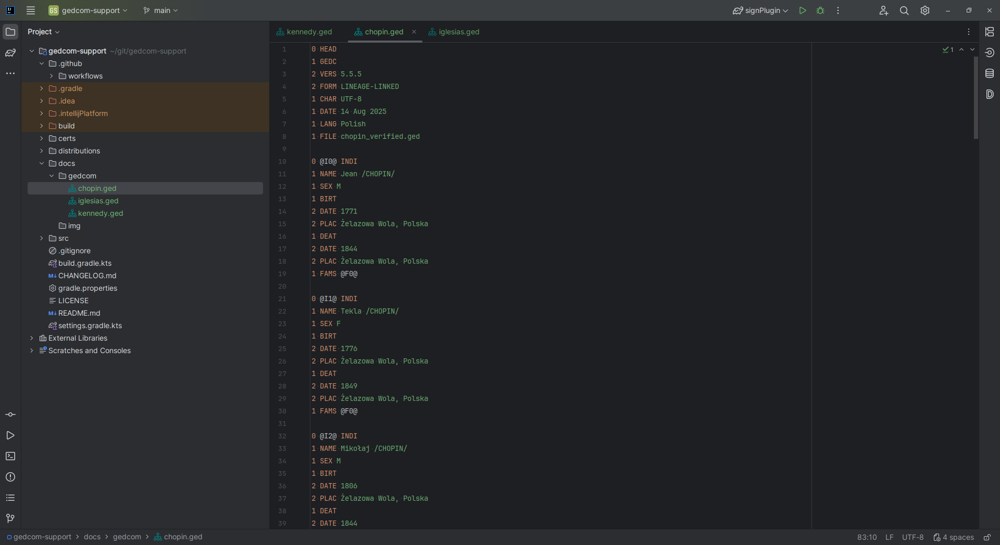

# GEDCOM Support for JetBrains IDEA

[](https://github.com/drexa1/gedcom-support/actions)
[](LICENSE)
[](https://plugins.jetbrains.com/plugin/12345-gedcom-support)

---

<div style="text-align: center;">
    If you find it useful, you can<br>
    <a href="https://buymeacoffee.com/yourusername" target="_blank">
        
    </a><br>
    🤗
</div>

## 📄 Overview

It includes so far:  
• **File type recognition** (`.ged` files)  
• **Syntax highlighting** for GEDCOM structures  
• **IDE integration** for a smoother genealogy research workflow



Here are some toy (but realistic) examples of GEDCOM files in case you need one  

• [John F. Kennedy](docs/gedcom/kennedy.ged), 35th president of the US.  
• [Frédéric François Chopin](docs/gedcom/chopin.ged), Polish composer and virtuoso pianist.  
• [Julio José Iglesias](docs/gedcom/iglesias.ged), Spanish successful singer and top record seller.  

---

## 📥 Installation

### From JetBrains Marketplace
1. Open **Settings → Plugins → Marketplace** in IntelliJ IDEA.
2. Search for **GEDCOM Support**.
3. Click **Install** and restart the IDE.

### From Disk
1. Download the latest release from the [Releases page](https://github.com/drexa1/gedcom-support/releases).
2. In IntelliJ IDEA, go to **Settings → Plugins → ⚙ → Install Plugin from Disk...**
3. Select the downloaded `.zip` and restart the IDE.

---

## 🔧 Development

To build the plugin locally:

```bash
  gradle build
```
